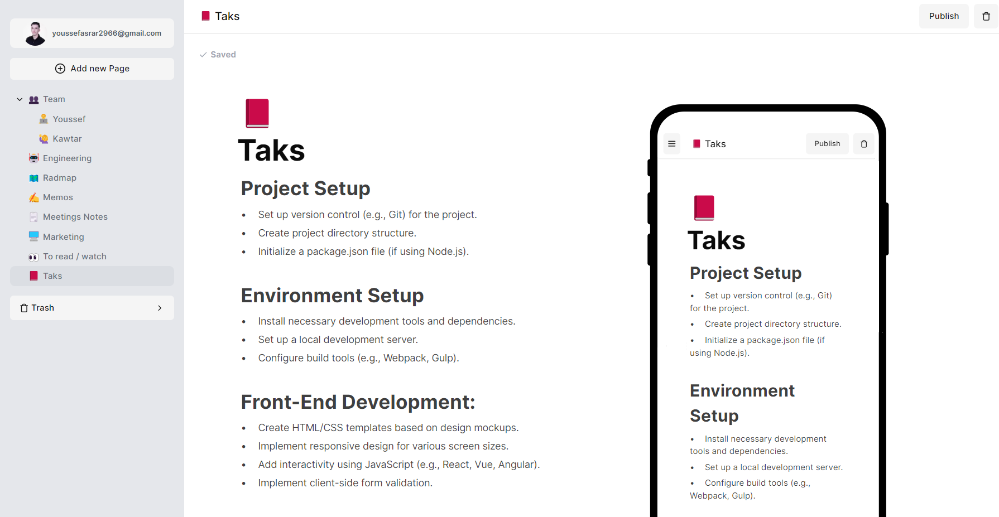

# Fullstack Notion Clone: Next.js 13, React, Tailwind, Prisma, Postgres


Key Features:

- Real-time database 🔗
- Notion-style editor 📝
- Light and Dark mode 🌓
- Infinite children documents 🌲
- Trash can & soft delete 🗑️
- Authentication 🔐
- Icons for each document (changes in real-time) 🌠
- Expandable sidebar ➡️🔀⬅️
- Full mobile responsiveness 📱
- Publish your note to the web 🌐
- Fully collapsable sidebar ↕️
- Landing page 🛬

### Prerequisites

**Node version 18.x.x**

### Cloning the repository

```shell
git clone https://github.com/yaserrar/notion-ya
```

### Install packages

```shell
npm i
```

### Setup .env file

```js
DATABASE_URL=

GOOGLE_CLIENT_ID=
GOOGLE_CLIENT_SECRET_ID=

NEXT_AUTH_SECRET=

NEXT_PUBLIC_LINK=
```

### Start the app

```shell
npm run dev
```
